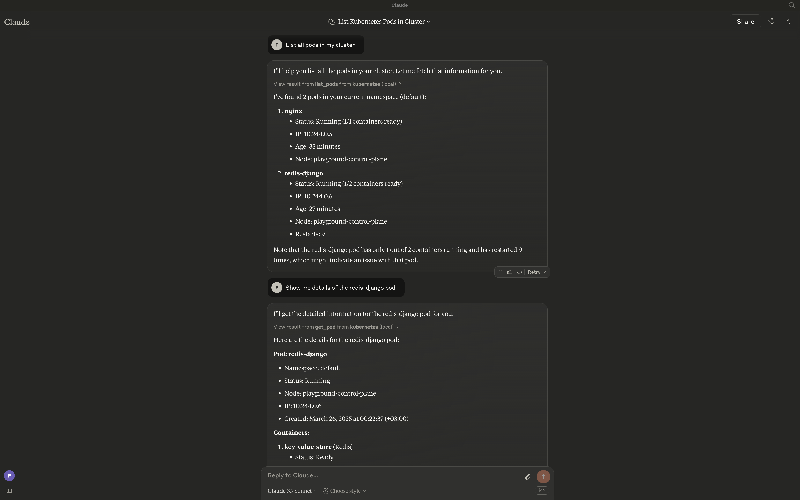

<p align="center">
  
</p>

# Kai - kubernetes MCP server

A Model Context Protocol (MCP) server for managing a Kubernetes cluster through llm clients like Claude, Ollama.

## Overview

Kai MCP server provides a bridge between large language models (LLMs) clients and your Kubernetes clusters, enabling users to interact with their Kubernetes resources through natural language. The server exposes a comprehensive set of tools for managing clusters, namespaces, pods, deployments, services, and other Kubernetes resources.

## Features

- [x] **Pods** - Create, list, get, delete, and stream logs
- [x] **Deployments** - Create, list, describe, and update deployments
- [x] **Services** - Create, get, list, and delete services
- [ ] **Cluster Management** - Connect, list, switch, and monitor clusters
- [x] **Namespaces** - Create, list, update, and delete namespaces
- [ ] **Ingress** - HTTP/HTTPS routing and TLS configuration
- [ ] **ConfigMaps & Secrets** - Configuration and secret management
- [ ] **Jobs & CronJobs** - Batch workload orchestration
- [ ] **Nodes** - Node monitoring, cordoning, and draining
- [ ] **Utilities** - Port forwarding, events, and API exploration
- [ ] **Persistent Volumes** - Storage management and claims
- [ ] **RBAC** - Role-based access control
- [ ] **Custom Resources** - CRD and custom resource operations

## Requirements 
The server will by default connect to your current context. Make sure you have:  

Access to a Kubernetes cluster configured for kubectl (e.g. minikube, Rancher Desktop,  EKS, GKE, etc.)

## Installation

To install the Kubernetes MCP server, run:

```sh
go install github.com/basebandit/kai/cmd/kai
```

## Integration with Claude for Desktop

`code ~/Library/Application\ Support/Claude/claude_desktop_config.json`

Add the server to your **Claude for Desktop** configuration by editing `claude_desktop_config.json`:

```json
{
  "mcpServers": {
    "kubernetes": {
      "command": "/path/to/kai binary"
    }
  }
}
```


