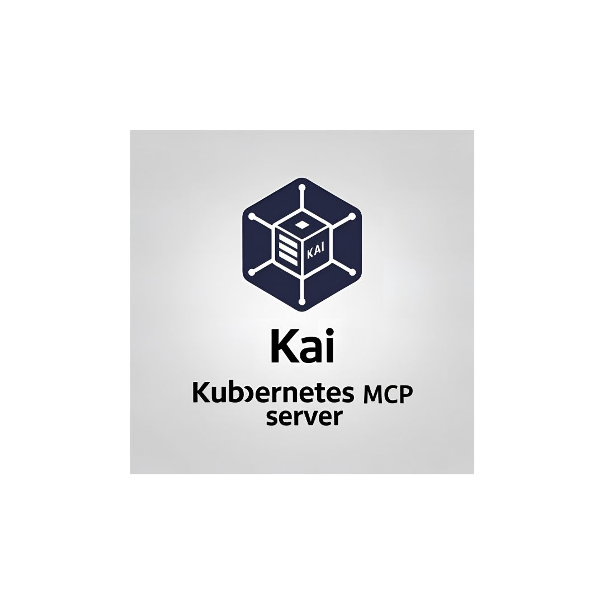
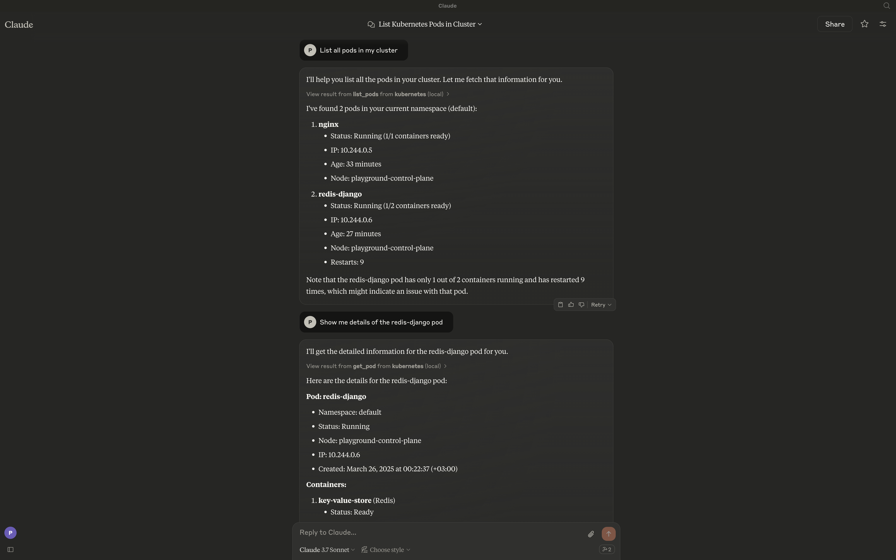

<p align="center">
  
</p>

# Kai - Kubernetes MCP Server

A Model Context Protocol (MCP) server for managing Kubernetes clusters from MCP-compatible clients like Claude Desktop, Cursor, and Continue.

## Overview

Kai exposes Kubernetes operations as MCP tools, letting an LLM client manage your cluster through natural language — workloads, networking, config, storage, RBAC, custom resources, and raw manifests.

## Features

### Core Workloads
- [x] **Pods** - Create, list, get, delete, and stream logs
- [x] **Deployments** - Create, list, describe, and update
- [x] **Jobs** - Batch workload management (create, get, list, delete)
- [x] **CronJobs** - Scheduled batch workloads (create, get, list, delete)

### Networking
- [x] **Services** - Create, get, list, and delete
- [x] **Ingress** - HTTP/HTTPS routing, TLS configuration (create, get, list, update, delete)

### Configuration
- [x] **ConfigMaps** - Configuration management (create, get, list, update, delete)
- [x] **Secrets** - Secret management (create, get, list, update, delete)
- [x] **Namespaces** - Namespace management (create, get, list, delete)

### Cluster Operations
- [x] **Context Management** - Switch contexts, list contexts, rename, delete
- [x] **Nodes** - Node monitoring, cordoning, and draining (list, get, cordon, uncordon, drain)
- [x] **Cluster Health** - Cluster status and resource metrics (cluster health, node/pod metrics)

### Storage
- [x] **Persistent Volumes** - PV management (list, get, delete) and PVC management (create, list, get, delete)
- [x] **Storage Classes** - Storage class operations (list, get)

### Security
- [x] **RBAC** - Roles, RoleBindings, ClusterRoles, ClusterRoleBindings, and ServiceAccounts (list, get)

### Utilities
- [x] **Port Forwarding** - Forward ports to pods and services (start, stop, list sessions)

### Advanced
- [x] **Apply/Delete Manifests** - Apply or delete raw YAML/JSON, multi-document and any kind including CRDs (apply_yaml, delete_yaml)
- [x] **Custom Resources** - CRD and custom resource operations (list/get CRDs, list/get/delete custom resources)
- [x] **Events** - Event listing and filtering (by namespace, type, involved object)
- [x] **API Discovery** - API resource exploration (list_api_resources)

## Requirements

The server connects to your current kubectl context by default. Ensure you have access to a Kubernetes cluster configured for kubectl (e.g., minikube, Rancher Desktop, kind, EKS, GKE, AKS).

## Installation

```sh
go install github.com/basebandit/kai/cmd/kai@latest
```

### Container image

A multi-arch image (linux/amd64, linux/arm64) is published on Docker Hub:

```sh
docker pull cyclon/kai:v1.0.0
docker run --rm cyclon/kai:v1.0.0 -version
```

## CLI Options

```
kai [options]

Options:
  -kubeconfig string        Path to kubeconfig file (default "~/.kube/config")
  -context string           Name for the loaded context (default "local")
  -in-cluster               Use in-cluster config (when running inside a pod)
  -transport string         stdio (default), streamable-http, or sse-legacy
  -sse-addr string          HTTP listen address for streamable-http/sse-legacy (default ":8080")
  -tls-cert string          Path to TLS certificate (enables HTTPS)
  -tls-key string           Path to TLS private key (enables HTTPS)
  -request-timeout duration Timeout for Kubernetes API requests (default 30s)
  -metrics                  Expose Prometheus metrics at /metrics (default true)
  -log-format string        json (default) or text
  -log-level string         debug, info, warn, error (default "info")
  -version                  Show version information
```

Logs are written to stderr in structured JSON format by default, making them easy to parse:

```json
{"time":"2024-01-15T10:30:00Z","level":"INFO","msg":"kubeconfig loaded","path":"/home/user/.kube/config","context":"local"}
{"time":"2024-01-15T10:30:00Z","level":"INFO","msg":"starting server","transport":"stdio"}
```

## Configuration

### Claude Desktop

Edit your Claude Desktop configuration:

```sh
# macOS
code ~/Library/Application\ Support/Claude/claude_desktop_config.json

# Linux
code ~/.config/Claude/claude_desktop_config.json
```

Add the server configuration:

```json
{
  "mcpServers": {
    "kubernetes": {
      "command": "/path/to/kai"
    }
  }
}
```

With custom kubeconfig:

```json
{
  "mcpServers": {
    "kubernetes": {
      "command": "/path/to/kai",
      "args": ["-kubeconfig", "/path/to/custom/kubeconfig"]
    }
  }
}
```

### Cursor

Add to your Cursor MCP settings:

```json
{
  "mcpServers": {
    "kubernetes": {
      "command": "/path/to/kai"
    }
  }
}
```

### Continue

Add to your Continue configuration (`~/.continue/config.json`):

```json
{
  "experimental": {
    "modelContextProtocolServers": [
      {
        "transport": {
          "type": "stdio",
          "command": "/path/to/kai"
        }
      }
    ]
  }
}
```

### HTTP Mode (web clients, remote use)

For non-stdio clients, run the streamable HTTP transport:

```sh
kai -transport=streamable-http -sse-addr=:8080
```

The MCP endpoint is `http://localhost:8080/mcp`. Health probes are at `/healthz`
and `/readyz`, and Prometheus metrics at `/metrics`. The legacy SSE transport
(`-transport=sse-legacy`, endpoint `/sse`) still works but is deprecated.

### Custom Kubeconfig

By default, Kai uses `~/.kube/config`. You can specify a different kubeconfig:

```sh
kai -kubeconfig=/path/to/custom/kubeconfig -context=my-cluster
```

### Running Inside a Kubernetes Cluster

When deploying Kai inside a Kubernetes cluster, use the `-in-cluster` flag to automatically use the pod's service account credentials:

```sh
kai -in-cluster -transport=streamable-http -sse-addr=:8080
```

The recommended way to run Kai in-cluster is with [kmcp](https://kagent.dev/docs/kmcp/quickstart) (from [kagent](https://kagent.dev)), which manages MCP servers as `MCPServer` resources:

```yaml
apiVersion: kagent.dev/v1alpha1
kind: MCPServer
metadata:
  name: kai
spec:
  transportType: http
  httpTransport:
    targetPort: 8080
    path: /mcp
  deployment:
    image: cyclon/kai:v1.0.0
    port: 8080
    cmd: /kai
    args: ["-in-cluster", "-transport=streamable-http", "-sse-addr=:8080"]
    serviceAccountName: kai
```

kmcp creates the Deployment and Service for you. The service account needs RBAC for the resources Kai manages — broad `get`/`list`/`watch`, plus `create`/`update`/`delete` where you use mutating tools. See the [kmcp deploy guide](https://kagent.dev/docs/kmcp/deploy/server).

## Usage Examples

Once configured, you can interact with your cluster using natural language:

- "List all pods in the default namespace"
- "Create a deployment named nginx with 3 replicas using the nginx:latest image"
- "Show me the logs for pod my-app"
- "Delete the service named backend"
- "Create a cronjob that runs every 5 minutes"
- "Create an ingress for my-app with TLS enabled"
- "Port forward service nginx on port 8080:80"
- "Apply this manifest: <paste YAML>"

## Contributing

Contributions are welcome! Please see our contributing guidelines for more information.

## License

This project is licensed under the MIT License.

---

