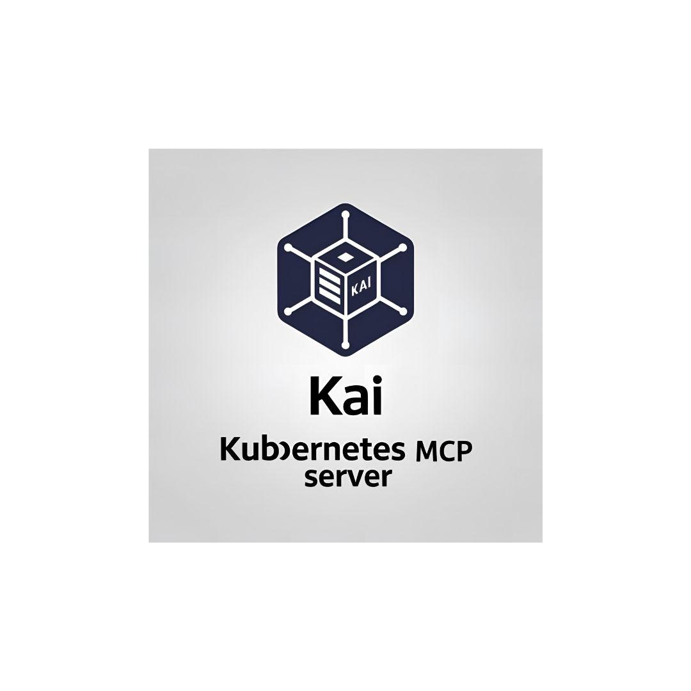

<p align="center">
  
</p>

# Kai - Kubernetes MCP Server

A Model Context Protocol (MCP) server for managing Kubernetes clusters through LLM clients like Claude and Ollama.

## Overview

Kai provides a bridge between large language models (LLMs) and your Kubernetes clusters, enabling natural language interaction with Kubernetes resources. The server exposes a comprehensive set of tools for managing clusters, namespaces, pods, deployments, services, and other Kubernetes resources.

## Features

### Core Workloads
- [x] **Pods** - Create, list, get, delete, and stream logs
- [x] **Deployments** - Create, list, describe, and update
- [x] **Jobs** - Batch workload management (create, get, list, delete)
- [x] **CronJobs** - Scheduled batch workloads (create, get, list, delete)

### Networking
- [x] **Services** - Create, get, list, and delete
- [x] **Ingress** - HTTP/HTTPS routing, TLS configuration (create, get, list, update, delete)

### Configuration
- [x] **ConfigMaps** - Configuration management (create, get, list, update, delete)
- [x] **Secrets** - Secret management (create, get, list, update, delete)
- [x] **Namespaces** - Namespace management (create, get, list, delete)

### Cluster Operations
- [x] **Context Management** - Switch contexts, list contexts, rename, delete
- [ ] **Nodes** - Node monitoring, cordoning, and draining
- [ ] **Cluster Health** - Cluster status and resource metrics

### Storage
- [ ] **Persistent Volumes** - PV and PVC management
- [ ] **Storage Classes** - Storage class operations

### Security
- [ ] **RBAC** - Roles, RoleBindings, and ServiceAccounts

### Utilities
- [x] **Port Forwarding** - Forward ports to pods and services (start, stop, list sessions)

### Advanced
- [ ] **Custom Resources** - CRD and custom resource operations
- [ ] **Events** - Event streaming and filtering
- [ ] **API Discovery** - API resource exploration

## Requirements

The server connects to your current kubectl context by default. Ensure you have access to a Kubernetes cluster configured for kubectl (e.g., minikube, Rancher Desktop, kind, EKS, GKE, AKS).

## Installation

```sh
go install github.com/basebandit/kai/cmd/kai@latest
```

## CLI Options

```
kai [options]

Options:
  -kubeconfig string   Path to kubeconfig file (default "~/.kube/config")
  -context string      Name for the loaded context (default "local")
  -in-cluster          Use in-cluster Kubernetes configuration (for running inside a pod)
  -transport string    Transport mode: stdio (default) or sse
  -sse-addr string     Address for SSE server (default ":8080")
  -log-format string   Log format: json (default) or text
  -log-level string    Log level: debug, info, warn, error (default "info")
  -version             Show version information
```

Logs are written to stderr in structured JSON format by default, making them easy to parse:

```json
{"time":"2024-01-15T10:30:00Z","level":"INFO","msg":"kubeconfig loaded","path":"/home/user/.kube/config","context":"local"}
{"time":"2024-01-15T10:30:00Z","level":"INFO","msg":"starting server","transport":"stdio"}
```

## Configuration

### Claude Desktop

Edit your Claude Desktop configuration:

```sh
# macOS
code ~/Library/Application\ Support/Claude/claude_desktop_config.json

# Linux
code ~/.config/Claude/claude_desktop_config.json
```

Add the server configuration:

```json
{
  "mcpServers": {
    "kubernetes": {
      "command": "/path/to/kai"
    }
  }
}
```

With custom kubeconfig:

```json
{
  "mcpServers": {
    "kubernetes": {
      "command": "/path/to/kai",
      "args": ["-kubeconfig", "/path/to/custom/kubeconfig"]
    }
  }
}
```

### Cursor

Add to your Cursor MCP settings:

```json
{
  "mcpServers": {
    "kubernetes": {
      "command": "/path/to/kai"
    }
  }
}
```

### Continue

Add to your Continue configuration (`~/.continue/config.json`):

```json
{
  "experimental": {
    "modelContextProtocolServers": [
      {
        "transport": {
          "type": "stdio",
          "command": "/path/to/kai"
        }
      }
    ]
  }
}
```

### SSE Mode (Web Clients)

For web-based clients or custom integrations, run in SSE mode:

```sh
kai -transport=sse -sse-addr=:8080
```

Then connect to `http://localhost:8080/sse`.

### Custom Kubeconfig

By default, Kai uses `~/.kube/config`. You can specify a different kubeconfig:

```sh
kai -kubeconfig=/path/to/custom/kubeconfig -context=my-cluster
```

### Running Inside a Kubernetes Cluster

When deploying Kai inside a Kubernetes cluster, use the `-in-cluster` flag to automatically use the pod's service account credentials:

```sh
kai -in-cluster -transport=sse -sse-addr=:8080
```

Example Kubernetes deployment:

```yaml
apiVersion: apps/v1
kind: Deployment
metadata:
  name: kai
spec:
  replicas: 1
  selector:
    matchLabels:
      app: kai
  template:
    metadata:
      labels:
        app: kai
    spec:
      serviceAccountName: kai
      containers:
        - name: kai
          image: ghcr.io/basebandit/kai:latest
          args: ["-in-cluster", "-transport=sse", "-sse-addr=:8080"]
          ports:
            - containerPort: 8080
```

Make sure the service account has appropriate RBAC permissions for the Kubernetes resources you want to manage.

## Usage Examples

Once configured, you can interact with your cluster using natural language:

- "List all pods in the default namespace"
- "Create a deployment named nginx with 3 replicas using the nginx:latest image"
- "Show me the logs for pod my-app"
- "Delete the service named backend"
- "Create a cronjob that runs every 5 minutes"
- "Create an ingress for my-app with TLS enabled"
- "Port forward service nginx on port 8080:80"

## Contributing

Contributions are welcome! Please see our contributing guidelines for more information.

## License

This project is licensed under the MIT License.

---

